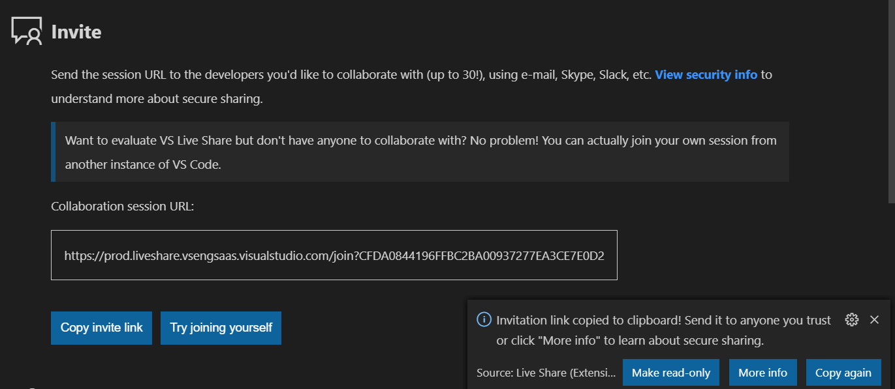
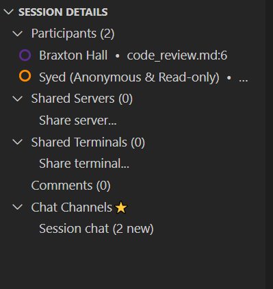
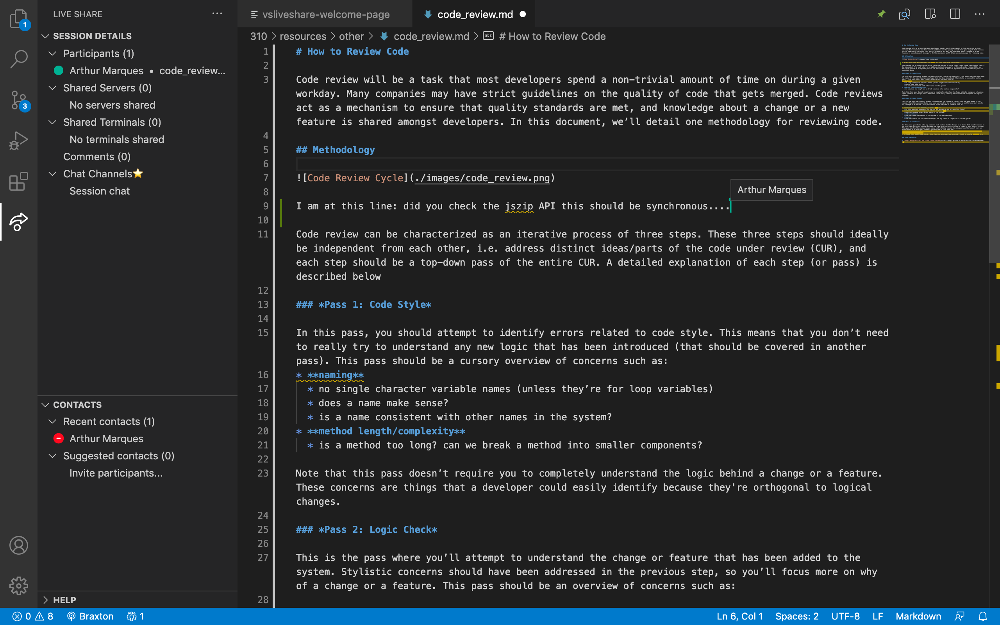

# Pair Programming

Sometimes, you might get stuck and don't know how to code something or you cannot find why your test keeps failing.  **That's natural.** *We do not know all the answers. Otherwise, there wouldn't be learning*

In this and other situations, it is worth working with your peers. You may even want to debug or code together. This is what we call **pair programming**.

In a pair programming section, one person, the driver, writes code while the other, the observer or navigator, reviews each line of code as it is typed in. The two programmers switch roles frequently. 

It is really important that and your peers respect boundaries. This is a learning exercise and if one always takes the driver seat, how can the other learn how to drive? Just be patient and help one another.

## Pair Programming Remotely

OK. Now that we know the basics, the challenge is: **how I do this remotely?**

Thankfully, there are several collaboration tools that you can use to circumvent the challenges of remote pair programming. We will list a phew and leave other resources as links on this page.

Basically, you need:

* a video communication tool, e.g.:
    * [Google Meet](https://meet.google.com/)
    * [Zoom](https://zoom.us/)
    * [Slack](https://slack.com/intl/en-ca/)
* a collaboration tool
    * [VSCode live share](https://visualstudio.microsoft.com/services/live-share/)
    * [Intellij code with me](https://www.jetbrains.com/help/idea/code-with-me.html)
    * [Atom floobits](https://floobits.com/)

We illustrate real-time collaboration with **VSCode**
    
### Visual Studio Code live share

First, install the extension.

You can then start a new session and invite your peers to your session. If this is the first time using the extension, you might want to **sign in with Github**

Eventually, you will have a running collaboration session. Just copy and share the link with your group:

As your peers join the session, you will see them in the session details: 

Note that you can always make participants read-only to enforce the driver-observer behaviour of a pair programming session.

Your peers will see at what line you are at and any of your changes.

Perhaps you can point a line that you are having difficulty and your peer can write a comment in your code.

It is also worth asking that you set breakpoints at specific points.

Try the extension and define a work-flow that works for you. Once you are finished, you can always close a session at the top left corner menu:

### Pair programming tips

Take a look at ThoughtWork's [Seven principles of pair programming etiquette](https://www.thoughtworks.com/insights/blog/seven-principles-pair-programming-etiquette), a TL;DR:

1. Communication is as important as any technical details!

1. Make sure you have the right setup: extensions are installed, you are in a quiet place, and your web connection is reliable.

1. Think out loud. Explain your code without diving into too many details at first.

1. Whenever a driver is silent, an observer can ask her what she is thinking.

1. Rotate between driver and observer regularly. 

1. There might be knowledge gaps between a driver and an observer. This is normal and be mindful and respect differences. 

    * In the near future, at work, you may be the one in need of assistance. 

    * If one person is asking that things are exactly as they want it to be, you may want to politely step out of the session.

    * If pair programming is not the best at the moment, a good tip might be to say something as *hey, perhaps I need some more time to flesh this out and this might not be a good use of our time right now... can I get back to you later?*

## Respectful Environment

Everyone involved with CPSC 310 is responsible for understanding and abiding by UBC's [Respectful Environment Statement](https://hr.ubc.ca/working-ubc/respectful-environment).

The Statement of Principle of UBC's Respectful Environment Statement is:

> *"The best possible environment for working, learning and living is one in which respect, civility, diversity, opportunity and inclusion are valued. Everyone at the University of British Columbia is expected to conduct themselves in a manner that upholds these principles in all communications and interactions with fellow UBC community members and the public in all University-related settings."* 
