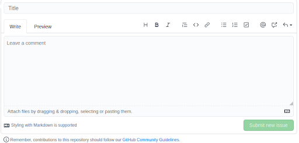
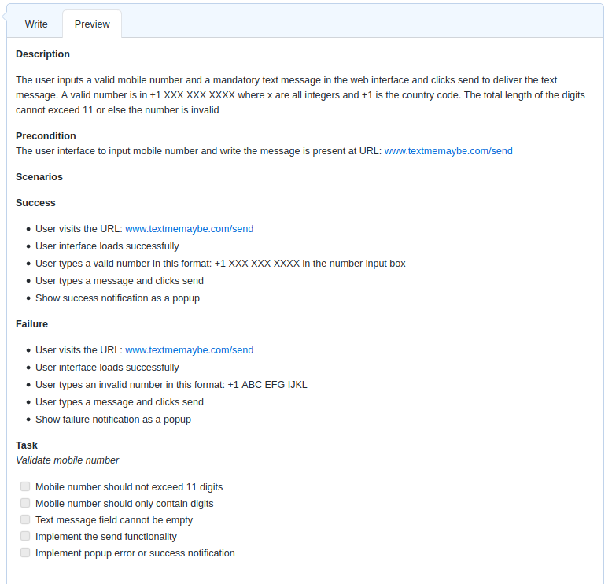
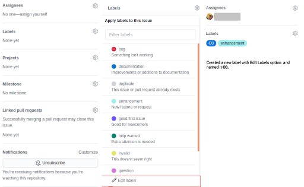
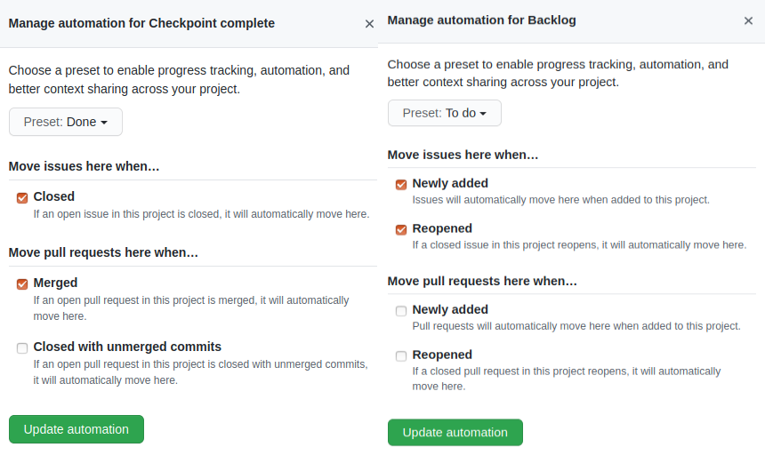
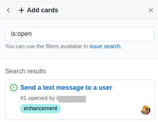
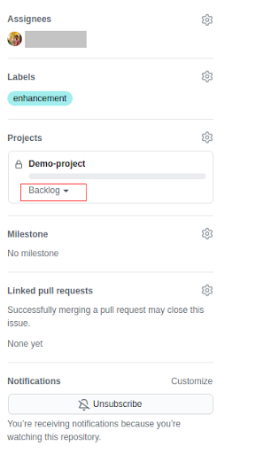

# Project Management

_Why do you need a project management tool?_

Project management tools (e.g., GitHub project management) help to effectively track the progress of the project by 
identifying sequential and dependent tasks which could be a blocking factor for project delivery. It provides a 
platform for discussing potential problems related to a task. It also helps to document the work for writing test 
codes so that you do not miss out on a test case!

Typical project management in GitHub follows the following procedure:

1. Creating an issue where you write down the description of a task to achieve and the steps for successful 
implementation of the task
2. Create a project management board that can consist of various columns such as backlog, developing, testing, 
in review, deployed to production, done, etc.
3. Assigning a task to an individual teammate and following up on progress or problems if required

**_Creating an Issue_**

_What is an issue in GitHub?_ 

GitHub uses issues to track tasks, bugs, ideas, or enhancements for work. Issues can be created manually or from a 
feedback comment from pull requests or reviews. You can track the issues in the project board to get an update about 
the overall project progress and identify critical dependency in the work for better resource management.

Example: Let’s say we want to implement a feature which sends a text message to a user:

1. Go to GitHub and click on your project repository

2. On the top you will find a navbar that looks like this:

    

3. Click on issues tab which will open up an window that looks like this:

    
4. Give a meaningful title to your issue and describe it

_How to write an issue without having an issue?_

**Basic Anatomy of an issue:**

A typical issue clearly describes what is going on, includes relevant user research, points to the necessary files, 
and has a checklist of actions to take. Some common sections may include a description, screenshots, steps to 
reproduce (specially if it is a bug), files, and a checklist of tasks. But do not go overboard with this! Your 
task may or may not use all the sections.

Example: Let’s say we are implementing a task that sends a text message to a user

Before you jump into coding think about the problem by asking yourself:

- What are you trying to achieve?
- Does the task have any precondition or dependencies?
- What are the possible success or failure scenarios?

Once you have the answer to the following questions create an issue in GitHub.

On your right side, there is a panel where you can label the issue and assign the issue to a teammate or yourself 
and select a project where the issue belongs. We will talk about the project in the later section for now lets 
select an assignee and a label for the issue! Once an issue is created you can comment, tag your teammate and discuss it.

The diagram shows the available options present by default for an issue: **bug, documentation, duplicate, enhancement** etc.

You should assign a label to your issues so that it is easy to find them later. You can create your own label too like 
**C0, C1** and assign multiple labels to an issue.

For more information on issues click here:

[https://docs.github.com/en/github/managing-your-work-on-github/creating-an-issue](https://docs.github.com/en/github/managing-your-work-on-github/creating-an-issue)

**_Creating a project board_**

Follow the steps outline here to create your first project board: 

[https://docs.github.com/en/github/managing-your-work-on-github/creating-a-project-board](https://docs.github.com/en/github/managing-your-work-on-github/creating-a-project-board)

Here is an example of how you can arrange your project board:

You can create your own columns and rename them as appropriate. 
To create this board I did not choose any project template and added the following columns: 
**backlog, developing, testing, in review, and checkpoint complete**

Usually, the backlog holds a list of tasks that need to be done in the project. Therefore, I have automated the 
backlog to be populated with issues once they are created. I did this by clicking on the 3 dots icon on the top right 
corner beside the column name and selecting manage automation.

This is the automation configuration selected for the backlog and checkpoint complete columns:

Every issue you create for this project will be automatically assigned to the **backlog** and you do not have to manually 
add it to this column if you have set up the above automation. However, if you want to assign any issue manually to 
any columns you can click “add new card” shown below:

This will open up the following pop up:

You can drag cards from this search filter to a specific column in the board

For more details see here: 
[https://docs.github.com/en/github/managing-your-work-on-github/adding-issues-and-pull-requests-to-a-project-board](https://docs.github.com/en/github/managing-your-work-on-github/adding-issues-and-pull-requests-to-a-project-board) 

You can also assign an issue to a specific column in a project when creating an issue. 
Just select the project the issue belongs to and a drop down of column names will appear. 
Select the column name from the drop down to move the issue to that column in the project board.

Additional information:

[https://docs.github.com/en/github/managing-your-work-on-github/about-automation-for-project-boards](https://docs.github.com/en/github/managing-your-work-on-github/about-automation-for-project-boards ) 

**_Assigning a task_**

You can assign a task to a teammate from the issue creation page or clicking on particular cards in the project board. 
While creating an issue on the right sidebar you will find the assignees tab which you can click and assign to 
a particular teammate. In case you want to assign an issue to a teammate from the project board, click on any 
issue on any column and a sidebar will pop up where you can select the assignee.

You can start a discussion on any issue by going to the issue page and commenting on it. You can tag your 
teammates in the comment also using `@`.

_So why are we doing this, again?_ 

- This acts as good documentation and makes implementation and testing lots easier
- You can efficiently manage and prioritize work to tackle any dependency
- You do not have to wait for your teammate’s email reply or call them up constantly asking what do I have to do? 
Trust me, this saves a lot of communication overhead during remote collaboration
- Most importantly, everyone has proper visibility as they can track the progress of the project and 
make adjustments accordingly

Additional Resources: 

- [GitHub Issues](https://docs.github.com/en/github/managing-your-work-on-github/managing-your-work-with-issues) 
- [Labeling issues and pull request](https://docs.github.com/en/github/managing-your-work-on-github/labeling-issues-and-pull-requests) 
- [Managing Project Board](https://docs.github.com/en/github/managing-your-work-on-github/managing-project-boards)
- [Tracking progress](https://docs.github.com/en/github/managing-your-work-on-github/tracking-the-progress-of-your-work-with-project-boards)
- [Create buggy issues](https://help.testlio.com/en/articles/113252-what-does-a-good-bug-report-look-like)

---
 [Syed Ishtiaque Ahmad](https://github.com/ishtiaque05)

